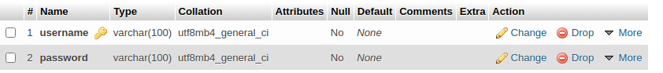
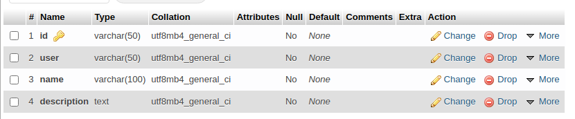
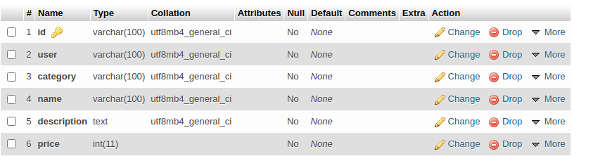

# grocery-store-php
grocery store made in php

## MYSQL PORT:3307

# DataBase Structure:
DatabaseName: grocery_store  
Table Names:
+ users
+ categories
+ items  

Users:  
 
 
Categories: 
 
 
 
Items:  
 
